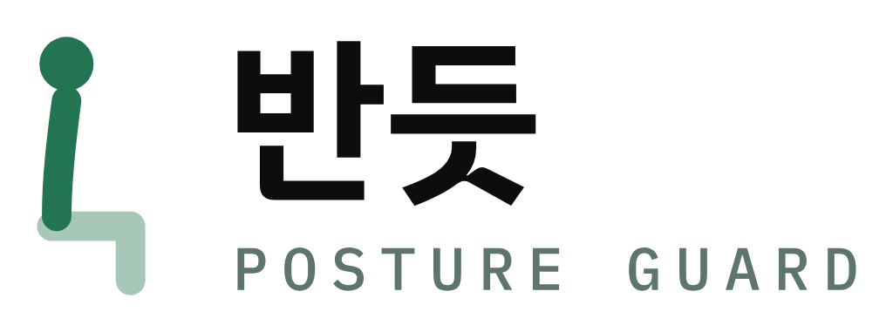
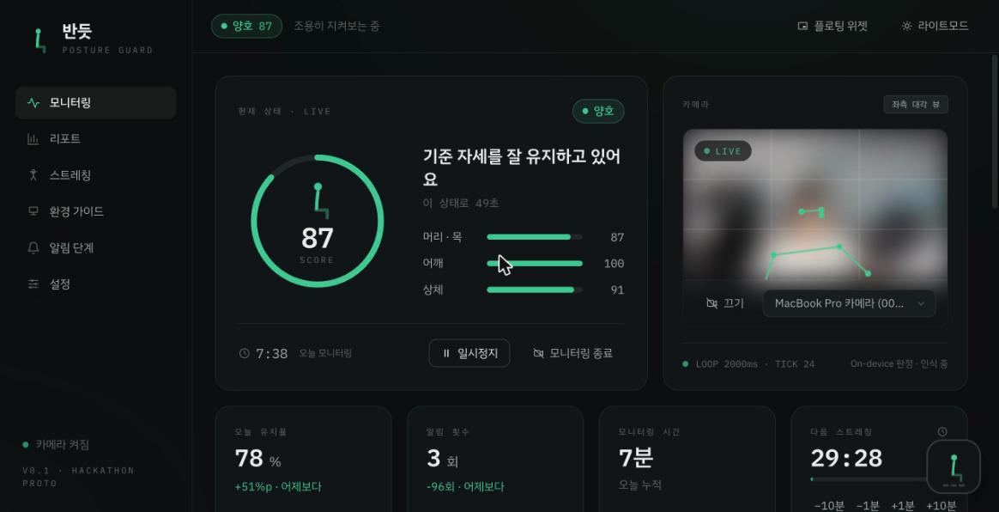
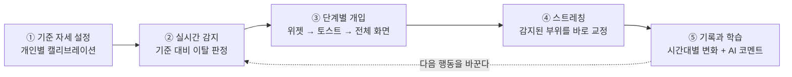
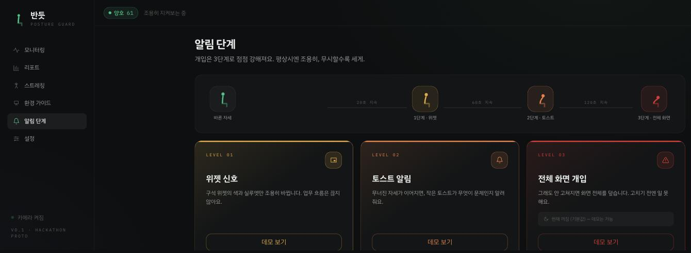
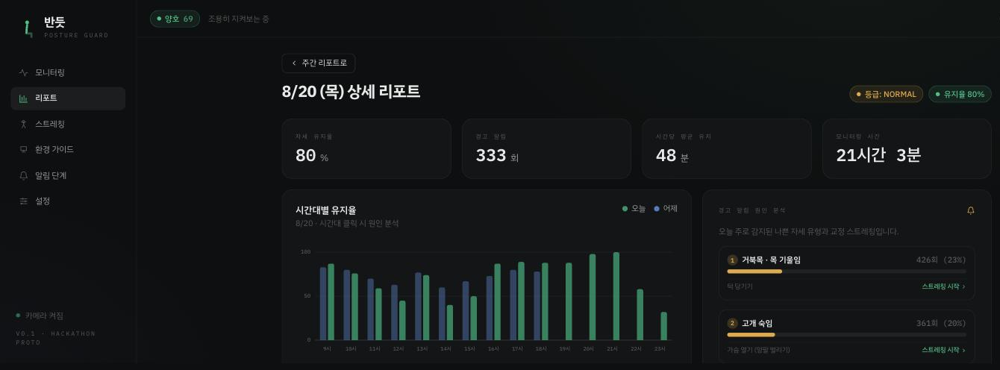
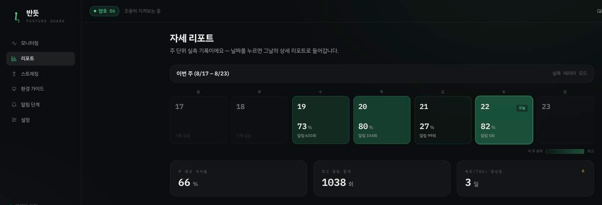
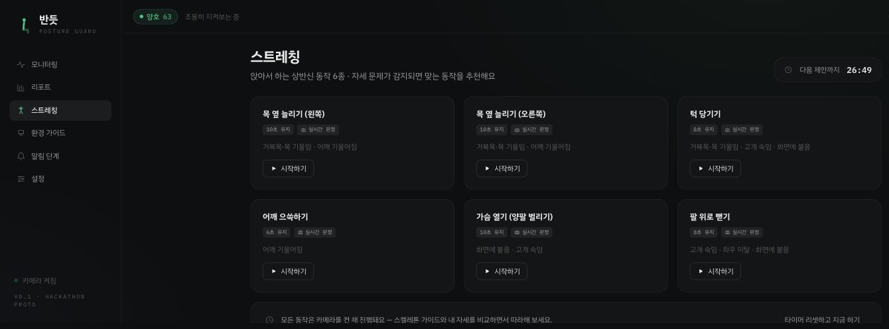
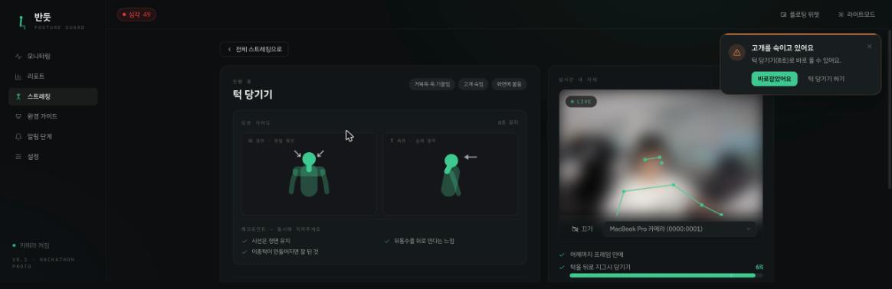
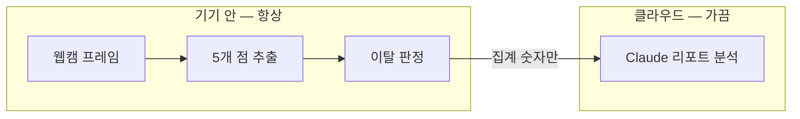

  <picture>
    <source media="(prefers-color-scheme: dark)" srcset="pictures/logo-dark.png">
    
  </picture>

<h3 align="center">몰입은 지키고, 자세는 바로잡습니다.</h3>

  웹캠 기반 실시간 자세 관리 서비스 
  Realtime Posture Feedback · Health Care · On-Device AI

  <a href="https://bandeut.site"><b>bandeut.site ↗</b></a>

  
  
  
  

  

모니터링 화면 · 웹캠 영상은 기기 안에만 머뭅니다 (스크린샷에서는 얼굴을 흐리게 처리했습니다)

---

## 🪑 문제 — 개발에 몰입할수록, 자세는 먼저 무너졌습니다

카카오테크 부트캠프 수강생들을 지켜보니, 개발에 몰입하는 순간과 평상시 모두에서
좋지 않은 자세가 반복되고 있었습니다.

| | |
|---|---|
| **몰입** | 화면에 가까워지며 고개와 상체가 앞으로 기울어집니다. |
| **습관** | 오래 앉을수록 흐트러진 자세가 평소 습관으로 굳습니다. |
| **문제** | 몸이 불편해지면 오래 집중하기도, 계속하기도 어려워집니다. |

> **몸이 건강해야 개발도 지속 가능합니다.**

문제는 "바른 자세를 몰라서"가 아닙니다. **무너지는 순간을 스스로 알아차리지 못해서**입니다.
그렇다고 자세를 잡아주겠다고 몰입을 깨버리면, 그건 그것대로 실패입니다.

## 💡 해답 — AI 컴퓨터 비전에서 찾았습니다

개인의 자세를 실시간으로 인식하고, 그 사람에게 맞는 교정과 피드백을 제공합니다.

| | | |
|---|---|---|
| **01 · CALIBRATION** | 기준 자세 설정 | 사용자의 바른 자세를 초기에 한 번 저장 |
| **02 · DETECT** | 실시간 자세 감지 | 웹캠으로 자세 변화를 즉시 인식 |
| **03 · FEEDBACK** | 맞춤 교정 피드백 | 무너진 순간, 알람과 스트레칭 제안 |
| **04 · SUSTAINABLE** | 지속 가능한 습관 | 리포트를 통한 건강한 개발 루틴 형성 |

**대상** — 카카오테크 부트캠프 수강생을 비롯해, 하루 대부분을 화면 앞에서 보내는 사람들

---

## 🔁 다섯 단계가 하나의 흐름으로 이어집니다

감지에서 끝나지 않고 교정과 기록까지 하나의 경험으로 연결하는 것이 반듯의 핵심입니다.

---

## 🔒 왜 온디바이스인가

웹캠 기반 자세 판정을 **사용자 브라우저 안에서** 처리하도록 구현했습니다.

| | | |
|---|---|---|
| **서버 트래픽 감소** | 웹캠 프레임을 업로드하지 않아 전송·추론 트래픽이 없습니다 | `LESS TRAFFIC` |
| **프라이버시 보호** | 카메라 원본 영상이 사용자 기기 밖으로 나가지 않습니다 | `PROTECTED` |
| **실시간성 보장** | 서버 왕복 없이 프론트에서 즉시 계산해 바로 반응합니다 | `REAL-TIME` |

| `INPUT` | `VISION` | `OUTPUT` |
|---|---|---|
| **웹캠 프레임** | **Pose Landmarker** | **자세 상태** |
| 사이트 내 카메라 접근 허용 | 프론트에서 관절 좌표 계산 | 판정 결과를 화면에 즉시 반영 |

자세 판정 경로에서 **서버를 한 번도 거치지 않습니다.** 덕분에 서버가 죽어도
모니터링과 경고는 그대로 동작합니다.

---

## ✨ 핵심 기능

### 🔔 자세 교정과 알람

자세가 무너진 **시간만큼 개입 강도가 커집니다.** 평상시에는 존재감을 드러내지 않습니다.

| | | |
|---|---|---|
| 🟢 **Level 0** | 바른 자세 | 평상시에는 조용히 모니터링만 합니다 |
| 🟡 **Level 1** | 위젯 신호 | 구석 위젯의 색과 실루엣만 바뀝니다 |
| 🟠 **Level 2** | 토스트 알림 | 무엇이 문제인지 짧고 구체적으로 안내합니다 |
| 🔴 **Level 3** | 전체 화면 | 사용자가 허용한 경우에만 강하게 개입합니다 |

> Level 3은 옵트인이며, **기본 알림 상한은 Level 2**입니다.

판정하는 자세 문제는 여섯 가지입니다 —
`거북목·목 기울임` `어깨 기울어짐` `고개 숙임` `화면에 붙음` `뒤로 처짐` `좌우 이탈`

무너진 자세가 **20초** 이어지면 위젯이, **60초**면 토스트가, **120초**면 전체 화면이 뜹니다.

### 📊 자세진단 리포트

**막연한 기억을 언제·왜 무너졌는지 보이는 기록으로** 바꿉니다.

- **하루를 시간대로 해석** — 유지율과 알림 원인을 함께 봐 자세가 흔들린 구간을 찾습니다
- **달력으로 습관의 흐름 확인** — 기록이 있는 날짜와 주 평균, 목표 달성일을 한눈에 봅니다
- **AI 코멘트로 다음 행동 제안** — 당일 측정 데이터를 요약하고 개선 포인트를 자연어로 제공합니다

즉시 교정의 결과가 하루의 패턴이 되고, 그 패턴이 내일의 행동을 바꿉니다.

### 🤸 스트레칭 권유

알림에서 끝내지 않고, **감지된 부위를 바로 풀어줍니다.** 카메라로 동작을 실시간 판정해
가이드 자세와 일치한 시간이 차면 자동으로 완료됩니다.

| 감지된 문제 | 추천 스트레칭 | 목적 |
|---|---|---|
| 거북목 · 고개 숙임 | 턱 당기기 · 가슴 열기 | 목 앞쪽 정렬과 굽은 상체 회복 |
| 목 · 어깨 기울임 | 목 옆 늘리기 | 좌우 목 긴장 완화와 기울임 회복 |
| 어깨 들림 · 상체 긴장 | 어깨 으쓱하기 | 어깨 긴장 완화와 상체 이완 |

동작에 들어가면 **정면·측면 모션 가이드**와 체크포인트가 함께 뜨고, 카메라가 실시간으로
자세를 판정합니다. 가이드와 일치한 상태를 정해진 시간만큼 유지하면 자동으로 완료됩니다.

---

## 🧠 AI 동작 구조 — 판정은 기기 안에서, 해석은 클라우드에서

민감도와 처리 빈도에 따라 AI의 역할을 나눠 **프라이버시와 실시간성을 모두** 지켰습니다.

| | 🖥 On-device AI | ☁️ Cloud AI |
|---|---|---|
| 모델 | Google MediaPipe Pose | Claude |
| 실행 | 항상 켜짐 · 브라우저 | 요청할 때만 |
| 하는 일 | 관절 좌표 추출 → 각도·거리 계산 → 이탈 판정 | 하루 기록의 흐름 해석, 습관·스트레칭·운동 조언 |
| 주기 | **2초마다** | 모니터링 종료 또는 분석 요청 시 |
| 입력 | 웹캠 프레임 (로컬) | **집계 숫자만** (시간대 · 유지율 · 알림 · 문제 횟수) |

판정에 쓰는 좌표는 **다섯 점** — 코, 양쪽 귀, 양쪽 어깨입니다
MediaPipe가 관절 33개를 내주지만, 앉은 자세 판정에 필요한 건 이 다섯 개뿐입니다.

> **원본 영상은 이 경계를 넘지 않습니다.** 클라우드로 가는 건 시간대·유지율·알림·문제 횟수뿐입니다.

---

## 🧱 기술 스택

| 레이어 | 스택 | 역할 |
|---|---|---|
| 프론트 (이 레포) | React 19 · Vite 7 · Tailwind 4 · MediaPipe Tasks Vision | 온디바이스 추론, 판정, 개입, 전 화면 |
| 앱 서버 | Spring (`:8080`) | JWT 인증, 리포트 집계·조회, 설정 저장 |
| AI 서버 | FastAPI (`:8000`) · OpenCV · MediaPipe · Claude | 하루 기록 LLM 분석 |

---

## 👥 팀

카카오테크 부트캠프 AI 해커톤 · Team 2

<table>
  <tr>
    <td align="center" width="130">
      <a href="https://github.com/Quart512">
         
        <b>jimmy.won</b>
      </a> AI
    </td>
    <td align="center" width="130">
      <a href="https://github.com/HyeerinCho">
         
        <b>lena.cho</b>
      </a> AI
    </td>
    <td align="center" width="130">
      <a href="https://github.com/circlepaper">
         
        <b>daniel.jo</b>
      </a> 클라우드
    </td>
    <td align="center" width="130">
      <a href="https://github.com/minjae196">
         
        <b>john.kim</b>
      </a> 클라우드
    </td>
    <td align="center" width="130">
      <a href="https://github.com/sohyuunii">
         
        <b>lina.park</b>
      </a> 풀스택
    </td>
    <td align="center" width="130">
      <a href="https://github.com/h26n">
         
        <b>hoon.lee</b>
      </a> 풀스택
    </td>
  </tr>
</table>

<b>반드시, 반듯.</b>

